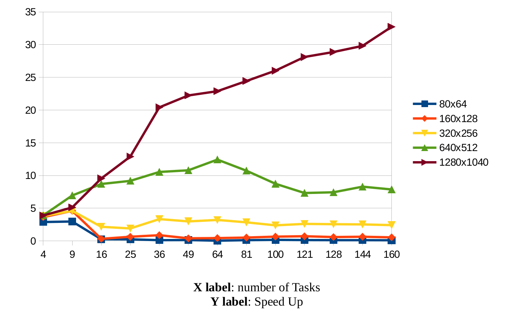
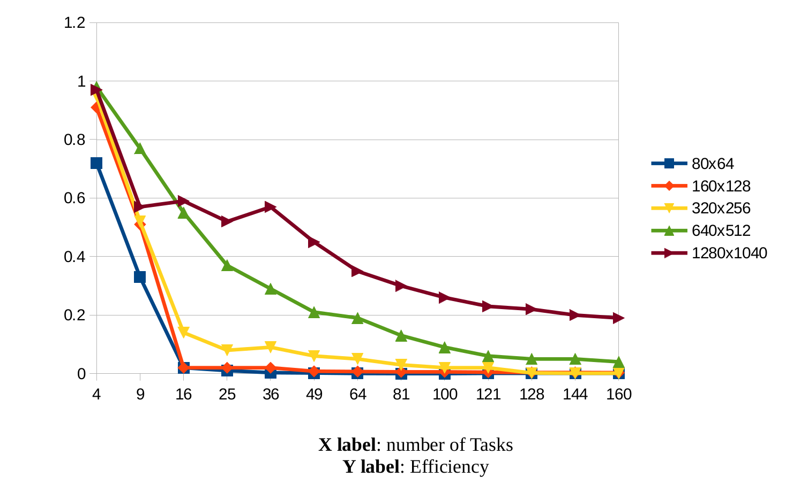

# Heat2D
<small>MPI program simulating the heat conduction in 2D</small>

## MPI

  * <b>Speed up</b>
    

  * <b>Efficinecy</b>
    
  

### MPI + Convergence check

### MPI + Parallel I\O

## Hybrid (MPI + OpenMP)

## Collaborators

[Kostantinos Athinaios](https://github.com/kostasA97)
[Theofanis Aslanidis](https://github.com/Fanarosss)
